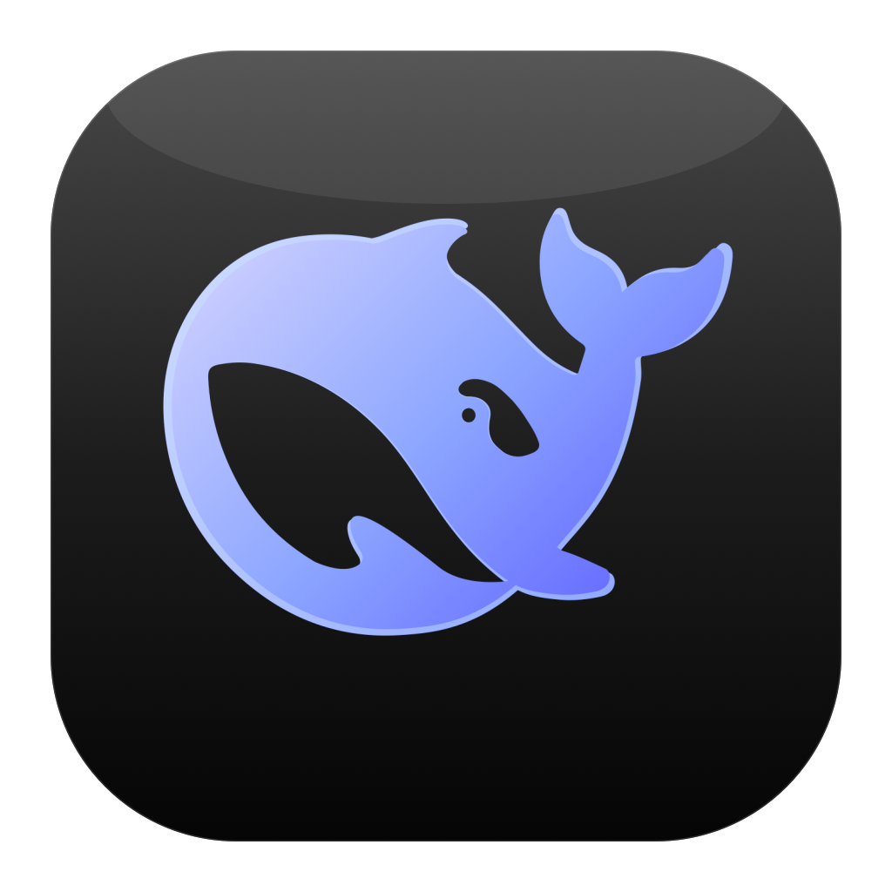
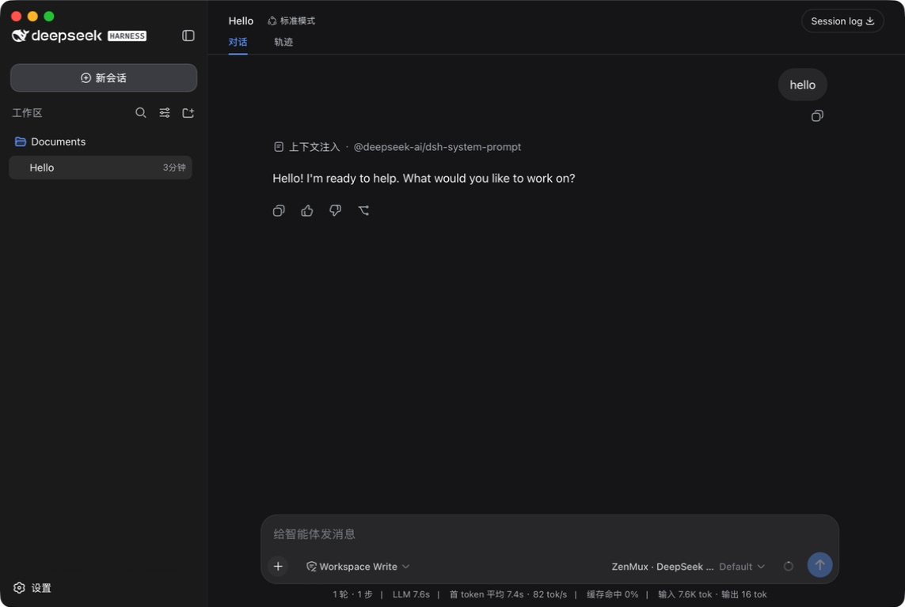
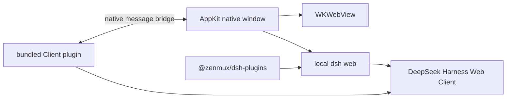

# DSH Desktop

> **中文** | [English](./README.md) · [简体中文](./README.zh-CN.md)

<div align="center">
  
  <h1>DSH Desktop</h1>
  <p><strong>A lightweight, native macOS client for <code>@deepseek-ai/dsh</code></strong></p>
  <p>Keeps the full DeepSeek Harness Web Client and adds the desktop capabilities an app actually needs.</p>
</div>



## Why this client?

DSH already ships a complete Web Client — there was no need to wrap it in another layer of navigation and sidebars. DSH Desktop launches the local `dsh web` with Swift, AppKit, and WKWebView, renders the raw interface directly, and fills in desktop capabilities such as window dragging, macOS window buttons, and a network proxy through a built-in Client plugin.

It is not Electron, and it does not reimplement the DSH UI. The app launches the bundled runtime directly on startup — it reaches the page in about half a second in practice.

## Highlights

- Full, unmodified DSH Web Client, sessions, workspaces, and settings UI
- Bundles `@deepseek-ai/dsh` and `@zenmux/dsh-plugins`
- Native macOS rounded-corner window, shadow, full screen, and standard menu bar
- Client plugin draws the macOS traffic-light buttons with hover effects
- When the sidebar collapses, the red close button stays aligned with the icon rail
- Drag the empty top area to move the window; double-click to zoom
- Built-in network proxy in Settings, supporting HTTP, HTTPS, SOCKS5, and a direct-connection list
- Proxy config applies to model requests, plugins, and DSH updates alike
- Checks for new DSH versions in the background after launch; you can also check and update manually
- Codex-style DeepSeek whale app icon

## Network proxy

Open `Settings → Network Proxy` to set the proxy address, a list of direct-connection hosts, or restore direct connections with one click.

After saving, the app restarts DSH and sets `HTTP_PROXY`, `HTTPS_PROXY`, `ALL_PROXY`, `NO_PROXY`, and the Node environment proxy switches for the child process. Local loopback addresses always stay direct-connected.

## Installation

Requirements:

- macOS 13 or newer
- Apple Silicon (the current Release is arm64)
- Node.js installed on the system

Download the archive from [Releases](https://github.com/ilimei/dsh-desktop/releases), extract it, and move `DSH Desktop.app` into your Applications folder.

## Build from source

You need the Xcode Command Line Tools, Node.js, and npm:

```bash
git clone https://github.com/ilimei/dsh-desktop.git
cd dsh-desktop
./build.sh
```

The first build installs the DSH and ZenMux dependencies. The output is at `dist/DSH Desktop.app`.

## Signing and distribution

The default build uses ad-hoc signing and is fine only for local development. For public distribution, use a fixed Apple Developer `Developer ID Application` certificate:

```bash
DSH_CODESIGN_IDENTITY="Developer ID Application: Your Name (TEAMID)" ./build.sh
```

When building with a Developer ID, the script enables the Hardened Runtime and timestamping. Before releasing, you should also complete Apple notarization with `notarytool` and run `stapler staple`.

## Project structure

```text
DSHClient.swift          Native AppKit / WKWebView client and updater
plugin/                  Bundled DSH Web Client extension
assets/                  App icon, screenshots, and the icon generator
runtime-install/         DSH and ZenMux dependency manifest
build.sh                 arm64 macOS build script
```

## Architecture



## License

[MIT](LICENSE)
