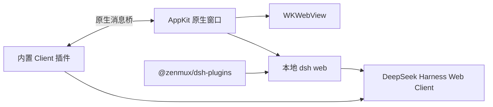

# DSH Desktop

> **简体中文** | [English](./README.md) · [简体中文](./README.zh-CN.md)

<div align="center">
  
  <h1>DSH Desktop</h1>
  <p><strong>为 <code>@deepseek-ai/dsh</code> 打造的轻量原生 macOS 客户端</strong></p>
  <p>保留完整 DeepSeek Harness Web Client，只补上桌面应用真正需要的能力。</p>
</div>


## 为什么做这个客户端

DSH 已经拥有完整的 Web Client，不需要再套一层重复的导航和侧边栏。DSH Desktop 使用 Swift、AppKit 与 WKWebView 启动本地 `dsh web`，直接呈现原始界面，并通过一个内置 Client 插件补齐窗口拖拽、macOS 窗口按钮、网络代理等桌面能力。

它不是 Electron，也不重新实现 DSH UI。应用启动时直接调用内置依赖，实测约半秒进入页面。

## 功能亮点

- 完整保留 DSH 原生 Web Client、会话、工作区和设置界面
- 内置 `@deepseek-ai/dsh` 与 `@zenmux/dsh-plugins`
- 原生 macOS 圆角窗口、阴影、全屏和标准菜单栏
- Client 插件绘制 macOS 三色按钮并提供 hover 效果
- 侧边栏折叠时自动只保留与图标栏对齐的红色关闭按钮
- 顶部空白区域可拖动窗口，双击可缩放窗口
- 设置页内置网络代理，支持 HTTP、HTTPS、SOCKS5 与直连名单
- 代理配置同时用于模型请求、插件和 DSH 更新
- 启动后后台检查 DSH 新版本，也可手动检查并更新
- Codex 风格的 DeepSeek 鲸鱼应用图标

## 网络代理

打开 `设置 → 网络代理`，可配置代理地址、直连主机列表，也可以一键恢复直连。

保存后应用会重新启动 DSH，并为子进程设置 `HTTP_PROXY`、`HTTPS_PROXY`、`ALL_PROXY`、`NO_PROXY` 和 Node 环境代理开关。本机回环地址始终保持直连。

## 安装

系统要求：

- macOS 13 或更高版本
- Apple Silicon 或 Intel Mac（请下载对应架构的 Release 安装包）
- 使用 nvm、fnm、Homebrew 或其他标准方式安装 Node.js

从 [Releases](https://github.com/ilimei/dsh-desktop/releases) 下载压缩包，解压后把 `DSH Desktop.app` 移入“应用程序”目录。

## 从源码构建

需要 Xcode Command Line Tools、Node.js 与 npm：

```bash
git clone https://github.com/ilimei/dsh-desktop.git
cd dsh-desktop
./build.sh
```

首次构建会安装 DSH 与 ZenMux 依赖，产物位于 `dist/DSH Desktop.app`。

在已安装 Rosetta 的 Apple Silicon Mac 上交叉构建 Intel 版本：

```bash
./build-x86_64.sh
```

Intel 产物位于 `dist-x86_64/DSH Desktop.app`。它使用独立的 npm 运行时目录，确保 Node 原生模块为 x86_64 架构。

## 固定签名与分发

默认构建使用 ad-hoc 签名，仅适合本机开发测试。公开分发应使用固定的 Apple Developer `Developer ID Application` 证书：

```bash
DSH_CODESIGN_IDENTITY="Developer ID Application: Your Name (TEAMID)" ./build.sh
```

使用 Developer ID 构建时，脚本会启用 Hardened Runtime 和可信时间戳。正式发布前还应使用 `notarytool` 完成 Apple 公证，并执行 `stapler staple`。

## 项目结构

```text
DSHClient.swift          原生 AppKit / WKWebView 客户端与更新器
plugin/                  内置 DSH Web Client 扩展
assets/                  应用图标、运行截图与图标生成器
runtime-install/         DSH 与 ZenMux 的依赖清单
build.sh                 arm64 macOS 构建脚本
build-x86_64.sh          Intel x86_64 macOS 交叉构建脚本
```

## 技术路线



## License

[MIT](LICENSE)
